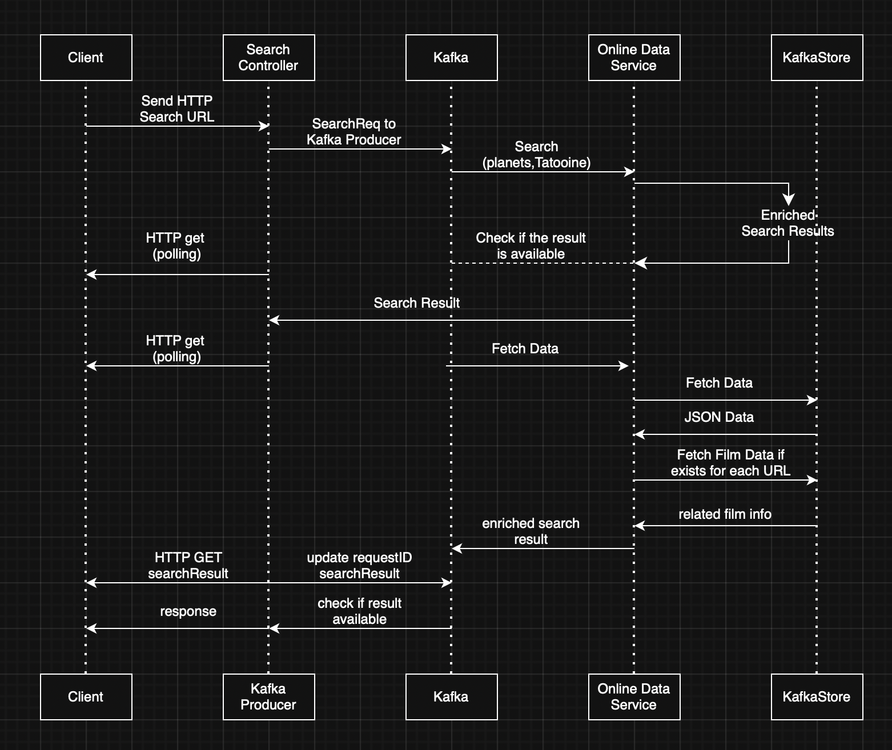
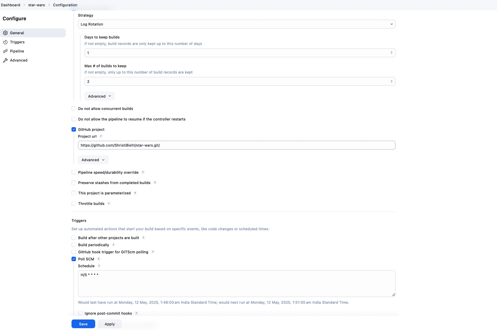

# Frontend Design Patterns

## 1. SearchForm.jsx

### Design Patterns:
- **Separation of Concerns**: UI logic is separated from caching (`cacheService`) and API (`apiService`) logic.
- **Controlled Components**: React's `useState` is used to manage form inputs.
- **Offline-First UX**: Supports offline searching via `localStorage`.
- **Conditional Rendering**: Dynamically shows results or errors.

### Implementation Highlights:
- Uses `localStorage` for cache persistence.
- Dynamically switches between offline and online modes.
- Data is displayed immediately from cache if offline.
- Tries live API and gracefully falls back to cached results if API fails.

---

## 2. apiService.js

### Design Patterns:
- **Service Abstraction**: Abstracts Axios calls into a service layer.
- **Error Handling Strategy**: Differentiates between Axios response, request, and setup errors.
- **Fail-Fast**: Validates response shape and throws errors early.

### Implementation Highlights:
- `fetchEntityData()` uses Axios with credentials.
- Response is validated to be a proper object.
- Logs detailed error contexts (status, request object, etc.).

---

## 3. cacheService.js

### Design Patterns:
- **Encapsulation**: Caching logic encapsulated into helper methods.
- **Graceful Degradation**: Tries/catches for JSON parsing failures.
- **Single Responsibility**: Keeps cache operations isolated from UI/API.

### Implementation Highlights:
- `getCachedData()` reads and parses JSON from `localStorage`.
- `storeInCache()` stores serialized JSON data to `localStorage`.

---

## 4. SearchResults.jsx

### Design Patterns:
- **Presentational Component**: Stateless and focused only on displaying data.
- **Null Guarding**: Returns `null` when no results are passed to avoid rendering noise.

---

## 5. serviceWorkerRegistration.js

### Design Patterns:
- **Progressive Enhancement**: Registers service workers only in production.
- **Separation of Concerns**: Encapsulates registration logic cleanly.
- **Graceful Failure**: Catches and logs registration failures.

---

# Backend Design Patterns

## 1. SearchController.java

### Design Patterns:
- **RESTful API**: Provides search and update endpoints.
- **HATEOAS Compliance**: Wraps search results in `EntityModel<>`.
- **Loose Coupling**: Delegates logic to `SearchService`, `KafkaProducer`.

### Implementation Highlights:
- Kafka message produced on `/search`.
- Updates and cache eviction exposed via dedicated endpoints.

---

## 2. SecurityConfig.java

### Design Patterns:
- **Declarative Security Configuration**: Uses `SecurityFilterChain` for HTTP security setup.
- **Open by Default**: Allows all endpoints for simplicity during development.

---

## 3. AppConfig.java

### Design Patterns:
- **Centralized Configuration**: Defines shared beans like `RestTemplate`.

---

## 4. WebConfig.java

### Design Patterns:
- **CORS Configuration**: Enables cross-origin requests to support frontend-backend separation.

---

## 5. OnlineDataServiceImpl.java

### Design Patterns:
- **Strategy Pattern**: Decides between offline and online services.
- **Resilience and Fallback**: Caches API data locally post-fetch.
- **Single Responsibility**: Focused only on fetching, parsing, and updating cache.

### Implementation Highlights:
- Assembles HATEOAS-compliant response.
- Converts film URLs into actual titles for readability.

---

## 6. OfflineDataServiceImpl.java

### Design Patterns:
- **In-Memory Caching**: Uses an in-memory store with Spring annotations.
- **Decorator Pattern (Spring Caching)**: Adds cacheability and eviction with annotations.
- **Logging & Observability**: Tracks cache hits and misses.

---

## 7. KafkaProducer / KafkaConsumer

### Design Patterns:
- **Event-Driven Architecture**: Decouples search request from processing using Kafka.
- **Asynchronous Messaging**: Consumer listens to `search-requests` topic.
- **Loose Coupling**: Kafka used to decouple user request from processing logic.

---

# Notable Design Concepts

- **Offline First**: Supports offline data access using browser cache and in-memory backend cache.
- **Microservice-Friendly**: Kafka integration enables distributed scaling.
- **Observability**: Strategic logging added for request flows and failures.
- **Resilience**: Handles fallbacks, caching, retries, and empty results gracefully.
- **HATEOAS**: Backend response is wrapped for hypermedia-driven APIs.

---

## Design Patterns Used

This microservice applies several core object-oriented and architectural design patterns to ensure modularity, testability, and maintainability.

---
### 1. **Strategy Pattern**
- **Context**: Selection between online and offline data fetching strategies.
- **Implementations**:
  - `OnlineDataServiceImpl` (calls Star Wars API)
  - `OfflineDataServiceImpl` (uses in-memory data)
- **Interface**: `SearchService`
- **Benefit**: Allows runtime flexibility in choosing data fetching logic.

---

### 2. **Adapter Pattern**
- **Class**: `StarWarsDataParser`
- **Purpose**: Converts third-party JSON API responses into internal `SearchResult` objects.
- **Benefit**: Isolates and encapsulates the transformation logic from the rest of the application.

---

### 3. **Decorator Pattern** (via Spring Cache)
- **Annotation**: `@Cacheable("searchResults")`
- **Class**: `OnlineDataServiceImpl`
- **Purpose**: Adds caching behavior without altering the core method.
- **Benefit**: Enhances performance and scalability transparently.

---

### 4. **Observer Pattern** (via Kafka)
- **Components**:
  - `KafkaProducer`: Publishes search logs.
  - `KafkaConsumer`: Consumes and logs messages.
- **Purpose**: Enables asynchronous event-driven logging.
- **Benefit**: Loose coupling and non-blocking communication.

---

## Sequence Diagram 

---

## **RUN BOOK**

### **Steps to install jenkins**
- **brew install jenkins-lts**
- **brew install jenkins-lts**
- **brew services start jenkins-lts --httpPort=8082**
- **jenkins-lts --httpPort=8082**

### **Jenkins Configuration**

## Steps to run the application
- docker-compose up --build
- Post services are up: http://localhost:3000

### else start backend and frontend explicitly
- on root folder : mvn clean package

### and then cd frontend dir, to start frontend explicitly and type 
- npm run build
- npm start
